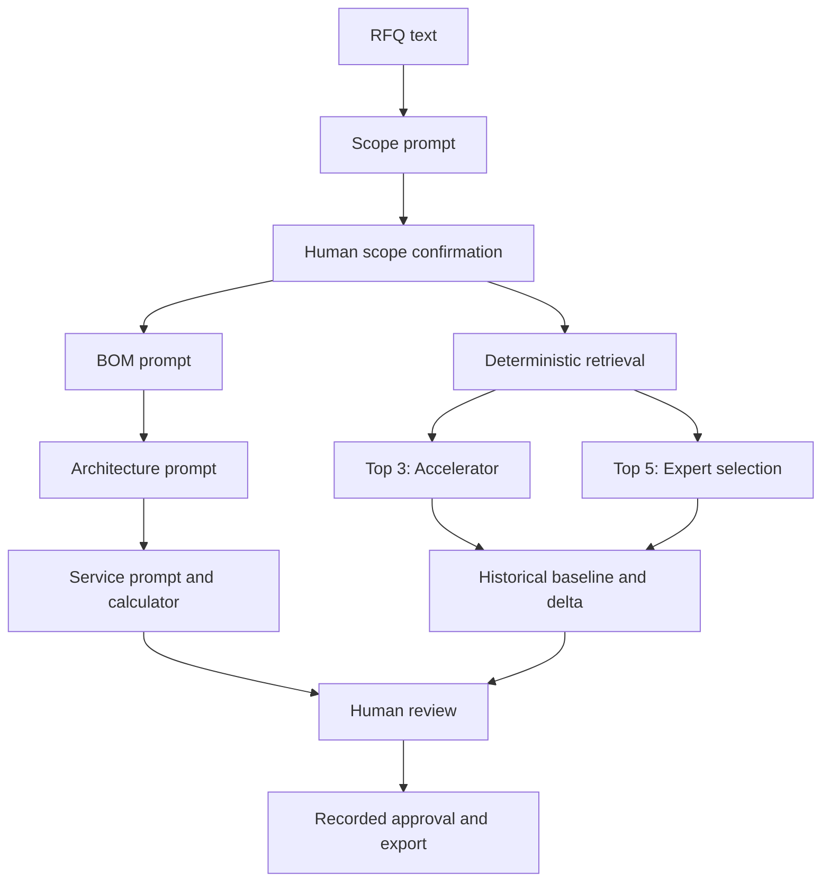

# Ataa — AI-assisted bid workspace

A runnable React + Node prototype with persistent SQLite storage and checkpointed agent workflows for the Presight assessment. One RFQ scope branches into Architect, Accelerator or Expert Tool, then converges at human review.

Start with [the implemented architecture](docs/ARCHITECTURE.md) and [data/storage, upgrade and backup instructions](docs/DATA_AND_STORAGE.md). This is phase one of the architecture implementation, still a local single-user app; no new Azure storage services are needed.

## 1. Run the app (Demo mode)

Install **Node.js 24.x** and npm (`node --version` should start with v24). This release uses Node’s built-in SQLite module. Extract this ZIP, then open a terminal in `ataa-prototype` (the folder containing `package.json`).

```bash
npm ci
npm run dev
```

Open **http://localhost:5173**. The backend runs at http://127.0.0.1:3001. Demo mode needs no API key and no `.env` file. The API server must run even in Demo mode, because it persists bids, validates workflow transitions and computes results.

For a built version:

```bash
npm run build
npm start
```

Open **http://localhost:3001**. Do not double-click `dist/index.html`; this application requires its Node backend. A ready-built `dist` is included, but rebuilding after any code edit is recommended.

## 2. Enable Azure Live AI

Copy the example environment file to `.env` in the project root.

macOS / Linux:

```bash
cp .env.example .env
```

Windows PowerShell:

```powershell
Copy-Item .env.example .env
```

Fill in:

```dotenv
AZURE_OPENAI_API_KEY=your-real-key
AZURE_OPENAI_ENDPOINT=https://your-resource.openai.azure.com
AZURE_OPENAI_DEPLOYMENT=your-deployment-name
ENABLE_LIVE_AI=true
```

Use the **Azure OpenAI resource endpoint, deployment name and key from the same resource**. An API key alone is not enough. Do not paste a Foundry portal page URL or a project URL containing `/projects/`. An endpoint already ending in `/openai/v1` is also accepted. The deployment name may differ from the underlying model name.

This adapter targets Azure OpenAI's `/openai/v1/chat/completions` API, using an `api-key` header, JSON object output and `max_completion_tokens`. Use a chat deployment compatible with these fields. A compatible GPT-4.1 deployment is a reasonable example; your tenant's model availability varies. Non-OpenAI Foundry model endpoints, assistants/agents endpoints, Entra ID authentication and legacy deployments with API-version requirements need a different adapter. No Azure API version is needed for this v1 path.

Stop and restart `npm run dev` after changing `.env`. Turn the top-right **Demo / Live AI** switch to **Live AI**. Create a new bid (or confirm the reset prompt for an existing unapproved bid), upload your RFQ or load the supplied sample, and analyse it.

Secrets are read only by `server/azure.js`. Never prefix a secret with `VITE_`, paste it into a React file, commit `.env`, or include `.env` when sharing a ZIP. This repository ignores `.env` and includes only `.env.example`.

Live calls were not exercised against a real Azure resource during development because no credentials were supplied. The adapter is implemented, but validate it using your own deployment before recording your live demonstration.

Microsoft reference:
- https://learn.microsoft.com/en-us/azure/ai-foundry/openai/api-version-lifecycle?tabs=key
- https://learn.microsoft.com/en-us/azure/foundry/openai/latest

## 3. Demo walkthrough

1. Click **New bid**. Keep `SCADA Modernization` and `Alpha Energy`, or name the local bid yourself.
2. Click **Load sample RFQ**, then **Analyse RFQ**.
3. Scope Agent returns 16 requirements and three clarification questions. Review equipment quantities, evidence and service scope. Edit fields or use **Edit full JSON** for other properties.
4. Click **Confirm & continue**. Open medium-priority questions carry into review. High-priority questions must be answered before confirming.
5. Select one path:
   - **Architect:** Runs BOM → Plant Architecture → Service Estimator in sequence. Inspect the BOM, click diagram nodes, and review rule-by-rule hours. The default sample totals **195.8 effort hours**, excluding support. These are synthetic assumptions, not engineering benchmarks.
   - **Accelerator:** Retrieves exactly three references, recommends the highest deterministic score and lets you select a baseline. The first reference has 10 cabinets vs 12 requested and a 28-week delivery window vs 24 requested.
   - **Expert Tool:** Retrieves exactly five references. Compare two or three side-by-side and select any result, including a lower-scoring project.
6. Continue to human review. Enter a reviewer name, record a disposition for open questions/exclusions/deltas, acknowledge the checklist, and approve.
7. Download the JSON snapshot. After approval, **Download proposal PDF** directly downloads a project-named PDF containing project details, BOM, a vector plant architecture and connection schedule, service hours, review items, approval and audit trail. No printer dialog opens. Reference workflows explicitly mark architecture/services that were not generated. JSON export remains available.
8. Create another bid to explore another branch. An approved snapshot is locked through the UI/API.

The assistant drawer answers a small set of contextual questions about scope, open clarifications, hours and match scores. It is a **deterministic context helper**, not an additional LLM agent or general-purpose chatbot.

## 4. What runs in each mode

| Capability | Demo | Live AI |
|---|---|---|
| Scope extraction | Labelled pre-generated Alpha Energy response | Azure Scope prompt applied to extracted RFQ text |
| BOM | Sample catalog selections; edited sample quantities are respected | Azure BOM prompt selects catalog products |
| Plant architecture | Sample topology, quantities reconciled to demo BOM | Azure Architecture prompt returns validated nodes/edges |
| Service estimation | Sample rule selection; server computes hours | Azure selects applicable rules; server computes hours |
| Accelerator / Expert | Deterministic retrieval | Same deterministic retrieval, using live-extracted scope |
| Catalog reference totals | Calculated in server code | Calculated in server code |
| Review, audit and exports | Functional | Functional |

Demo mode deliberately accepts only the bundled RFQ scenario for analysis. Arbitrary uploads require Live AI; the app never presents canned output as an analysis of an arbitrary uploaded document. The full JSON editor permits sample adjustments, but it does not make Demo mode capable of interpreting new requirements. Create a Live AI bid for that.

Switching modes clears the active document, extracted scope and downstream output for that bid; previous revisions and files remain under Project data. Live errors do not silently switch to demo. You may explicitly switch after a failed run and reload the sample.

## 5. Workflows and implementation

- Frontend: React 19 + Vite, Lucide icons, React Flow.
- Backend: Express 5, native Node `fetch`, Multer, PDF text extraction, Mammoth DOCX extraction.
- Contracts: JSON Schema in `shared/schemas.js`, validated using Ajv.
- Orchestration: explicit sequential JavaScript stages with persistent checkpoints, a pollable job and per-stage events. This is a specialized prompt workflow; it does **not** use LangGraph or autonomous planning.
- Data: controlled local JSON catalog, historical archive and service rules. No external database is needed.
- Persistence: `runtime/ataa.sqlite` plus `runtime/objects/` (or `ATAA_DATA_DIR`). Project revisions, audit, job checkpoints and file metadata live in SQLite. Original RFQs and PDF reports live in the file store. Interrupted jobs pause on restart and offer Resume / Discard. History does not automatically expire.



BOM/architecture/service steps are dependent and intentionally sequential. The app does not claim to run these three tasks in parallel. Scope runs once before any branch.

## 6. Prompt files

The four executable text prompts are in `prompts/`. The backend pins prompts and reference data for each run and sends the prompt and exact JSON Schema as a system message; RFQ/catalog/other stage data are sent as a separate JSON user message. Runtime placeholders from the earlier documents are therefore filled through a structured input object rather than string substitution.

Your original four prompt files are retained unchanged under `docs/original-prompts/`. Runtime v1.1 makes their concepts executable with smaller contracts:
- Removes unsupported model confidence percentages.
- Moves catalog prices and numerical service-hour computation into deterministic code.
- Uses formal JSON Schema instead of example JSON with pseudo-type strings.
- Requires real requirement IDs, catalog SKUs, edge endpoints and quantity allocations.
- Keeps source evidence, assumptions, gaps and human review.

The Azure adapter retries once if schema or reference validation fails, with the validation error as feedback. It does not retry billing/network errors automatically and does not silently use demo results. Prompt-injection instructions help, but they do not provide a security guarantee; backend validation is still required.

## 7. Data and matching

`data/ProductCatalog.json`: 20 synthetic products and AED reference unit prices.

`data/HistoricalProjects.json`: 10 synthetic projects, outcomes, metadata and historical BOM snapshots. They are intentionally simple demonstration records, not qualified engineering solutions.

`data/ServiceRules.json`: 10 synthetic effort rules. Fixed, product-category, scope-quantity and percentage drivers are implemented. Project management is 10% of non-percentage included effort. Unsupported services such as the unresolved support SLA are excluded and shown clearly.

`public/samples/AlphaEnergy_SCADA_RFQ.txt`: the readable sample tender. Downloadable from the upload screen.

Retrieval returns a weighted score **out of 100**, not a probability:

| Criterion | Points |
|---|---:|
| Exact normalized industry match | 25 |
| Exact normalized country match | 20 |
| Exact normalized system match | 25 |
| Exact normalized architecture match | 15 |
| Cabinet quantity similarity | 10 |
| Fraction of requested services present | 5 |

Cabinet points = `10 × max(0, 1 - abs(current-reference) / max(current,reference,1))`. Missing metadata earns zero rather than being guessed. Ties use project ID for stable ordering. This prototype uses no embeddings, vector database, GraphRAG, MCP connectors, CRM or ERP integrations.

Retrieved baselines **retain historical quantities**. The delta comparison is not an automatic redesign. Approval for Accelerator/Expert is explicitly named **Reference baseline approval**.

## 8. Uploads, limitations and sharing

Supported uploads: text-based PDF, DOCX, TXT and MD, up to 5 MB and 70,000 extracted characters. Scanned PDFs need OCR first. PDFs are extracted as text; original page coordinates, images and table layouts are not preserved. Source locators use available text markers, not invented page numbers.

This is a local single-user prototype. There is no authentication, enterprise RBAC, authenticated signature or tamper-resistant audit storage. The server binds to `127.0.0.1` by default. It rejects ordinary cross-origin browser requests but that is not authentication. Do not expose the live backend publicly without adding authentication, authorization, rate limits, request budgets and secure deployment configuration.

For the assessment, run Live AI locally when recording the demo. Share the ZIP without `.env`, `runtime` or `node_modules`. This v3 package is intended for local use. Shared deployment needs identity-based authorization, tenant isolation, persistent managed storage and distributed job control before exposing real RFQs or a secret-bearing backend. A static frontend host alone cannot run this full package.

The app does not send emails, write to CRM/ERP, create binding commercial offers or certify industrial designs. Technical review remains necessary.

## 9. Validation

```bash
npm test
npm run build
```

Optional full browser workflow checks (create synthetic test bids in an isolated test store):

```bash
npx playwright install chromium
npm run test:ui
```
