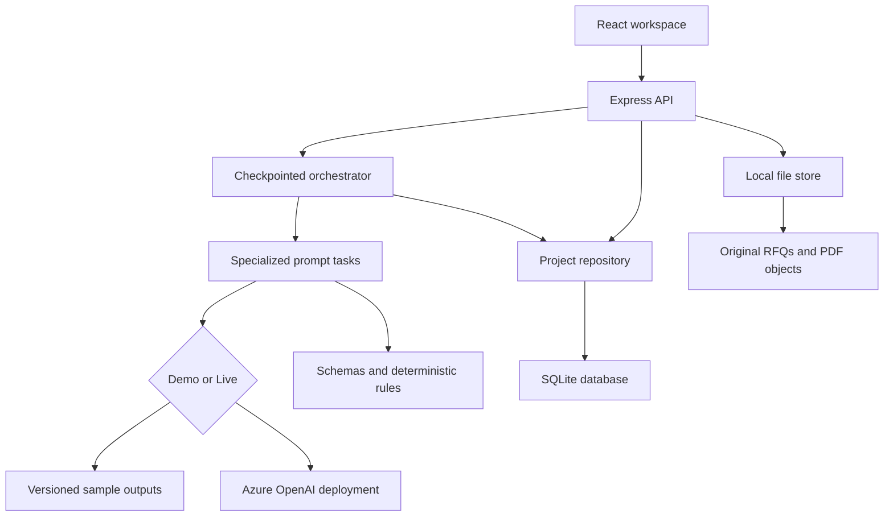
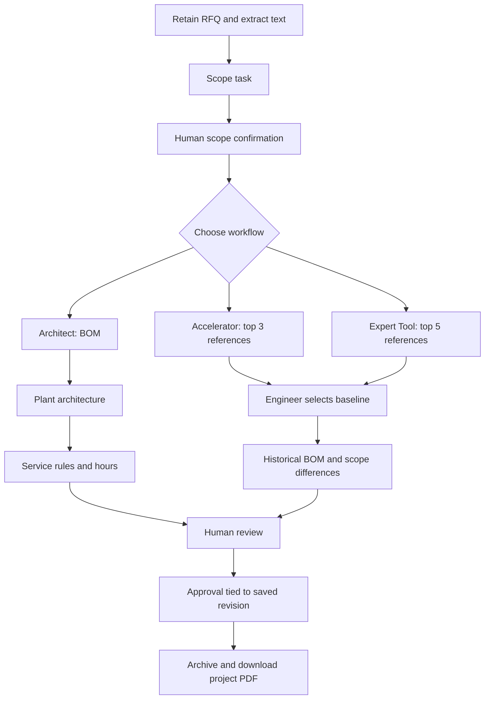
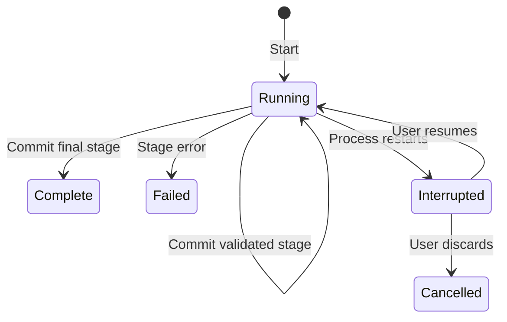
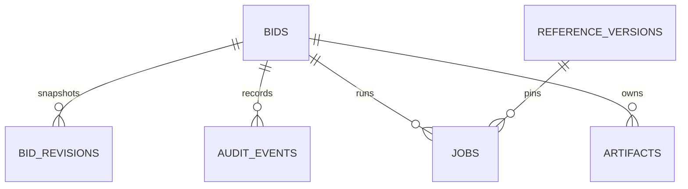

# Ataa v3 — implemented architecture foundation

Implemented on 1 October 2026. This release starts the detailed architecture implementation with persistent state, retained documents, revision history, provenance and restart recovery. It remains a local, single-user application. Azure SQL, Blob Storage, enterprise identity, a distributed worker queue and GraphRAG are **not deployed or implemented** in this release.

## 1. Components and boundaries

| Component | Implementation | Responsibility |
|---|---|---|
| User interface | `src/App.jsx`, `src/DataStorage.jsx` | RFQ / scope / workflow / review; recovery controls; project data and storage screens |
| API and composition | `server/index.js` | Request validation, upload extraction, approval, downloads, reference version registration |
| Orchestrator | `server/orchestrator.js` | Start, checkpoint, interrupt, resume, discard; commit stage output and checkpoint together |
| Agent tasks | `server/workflows.js` | Scope → BOM → Architecture → Service Estimation; schema checks and output handling |
| Azure adapter | `server/azure.js` | Server-side key, prompt plus schema, JSON object response, timeout and error handling |
| Deterministic engine | `shared/engine.js` | Reference scores, catalog joins, service calculations and reference checks |
| Repository | `server/storage/database.js` | SQLite schema, revisions, jobs, artifacts, audit, migration and optimistic concurrency |
| File adapter | `server/storage/files.js` | Content-addressed local bytes, safe keys, SHA-256 verification |
| PDF renderer | `server/pdf.js` | Project details, BOM, plant diagram, hours, review and audit |
| Backup command | `scripts/backup.js` | Offline, locked backup of database and objects together |

The repository and file store are separate modules so later cloud adapters have clear responsibilities. This is a module boundary, not an assertion that SQLite SQL is directly compatible with Azure SQL. The production adapter will need its own schema migrations, transactions and concurrency implementation.

## 2. Business workflow

Scope, BOM, Architecture and Service Estimation are four specialized prompt tasks. They are sequential because of their data dependencies; they are not independently deployed autonomous agents or a LangGraph graph. All Live tasks use the same configured Azure deployment. The context helper in the UI remains deterministic.

Architect inputs and outputs:

| Task | Input | Saved output and verification |
|---|---|---|
| Scope | Filename and extracted RFQ text | Scope JSON; schema, requirement IDs and quantity references |
| BOM | Confirmed scope and pinned product catalog | BOM JSON and calculated catalog totals; valid SKUs and requirement references |
| Architecture | Confirmed scope and accepted BOM | Nodes / edges; BOM references, quantity bounds and endpoints |
| Services | Scope, BOM, architecture and pinned rules | Rule selection plus calculated effort; duplicate / unknown / missing rule checks |

The empty engineering-rules and architecture-rules inputs remain placeholders. The implementation does not yet establish physical vendor compatibility, port sizing, safety certification or complete RFQ coverage.

Accelerator and Expert still use deterministic matching: industry 25, country 20, system 25, architecture 15, cabinet similarity 10, service overlap 5. These are scores out of 100, not probabilities or vector similarity. A retrieved BOM retains historical quantities. The selected reference uses the catalog version captured at retrieval, even after the app restarts with newer reference files. Imported v2 selections have no historical reference snapshot; the current version is explicitly attached when selecting a baseline.

## 3. Durable state and recovery

A new job stores its stage list, mode, pinned reference bundle, workflow-code fingerprint, timestamps and per-stage events in SQLite. For Live runs it also records the configured endpoint, deployment and maximum completion tokens. It never stores the API key.

For each completed stage, one database transaction commits:

1. The updated bid, including validated output.
2. Its new full revision snapshot.
3. The appended audit event.
4. The job's completed-stage checkpoint.

The last stage also marks the job complete and unlocks the bid in that transaction. A failed stage does not publish partially constructed outputs. The error is recorded against the last committed bid.

After a process restart, unfinished runs become **Interrupted**. The user sees **Resume interrupted workflow** and **Discard interrupted run**. Resume skips committed stages and reruns the first unfinished stage. No Azure request is automatically issued on restart. For Live runs the user must acknowledge that an interrupted request may already have been billed and may be repeated. This is at-least-once invocation of the unfinished model step, not exactly-once Azure execution.

Edits and approval are blocked while a run is running or awaiting recovery. Discard preserves old checkpoints and revision history but clears partial current solution results. Failed runs can be started again through the normal workflow buttons; they do not currently have in-place retry.

Resume is rejected if the workflow-code fingerprint changed. Live resume is also rejected if endpoint, deployment or maximum completion tokens changed. Restore the prior configuration or discard and start a fresh run. The recorded deployment name is not proof of an immutable underlying model version; a deployment may be changed externally.

The local process lock prevents two Ataa API processes from sharing one data directory on the same machine. It is not a multi-host lease. Do not run this database on a network filesystem or share it among containers / servers.

## 4. Data model

`bids`, `bid_revisions`, `audit_events`, `jobs`, `artifacts`, `reference_versions` and `settings` are physical SQLite tables. Bid relationships use foreign keys. The reference-version ID is currently a reference inside job/bid JSON and is resolved in code, not a SQL foreign key. Agent events and business structures such as requirements, BOM lines, diagram nodes and service lines are nested JSON, not separate relational tables.

This hybrid model gives the local prototype transactions and queryable identity/status fields without immediately normalizing every changing agent schema. Each bid row contains the full current aggregate; each revision contains a full copy, including extracted RFQ text and audit. This is deliberately simple and can consume substantial space over time. Production should separate documents and immutable stage outputs, and reference them from revisions.

See **DATA_AND_STORAGE.md** for every table, filesystem location, data lifecycle and backup/restore procedure.

## 5. Provenance and human approval

On startup, catalog, historical projects, service rules, runtime prompts, schemas and demo fixtures are serialized into a bundle. Its SHA-256 hash is the version ID; the entire bundle is stored once in `reference_versions`. Jobs pin that ID. Workers load their catalog, rules, prompts and fixtures from the pinned bundle instead of rereading changed files during recovery.

The workflow fingerprint covers API/orchestration/agent/adapter/schema/calculation source. Full application code and npm dependency versions are supplied in the ZIP and lockfile, rather than duplicated in every database row. Keep the release ZIP with backups for reproducibility. Byte-identical model generation is not promised.

Approval records the reviewer, notes, time, mode, approval type, conditions and the exact committed revision number. The current UI/API then locks the bid. Prior revisions remain downloadable read-only snapshots. Approvals are still self-attested names, not Entra ID identities or cryptographic signatures. Local machine administrators can edit storage; the audit is not tamper-resistant.

PDFs retain the project-named direct download behavior. A PDF is generated on first request for a revision, then retained as an artifact; later requests reuse the same bytes. A draft PDF can be generated through the API after scope exists, while the UI exposes the proposal button after approval. The renderer labels draft/approved status. Active/interrupted workflows cannot export a PDF until settled.

## 6. API additions

| Route | Behavior |
|---|---|
| `GET /api/storage` | Storage description and record counts |
| `GET /api/bids/:id/data` | Revision list, artifact metadata and run history |
| `GET /api/bids/:id/revisions/:revision` | Download a saved JSON snapshot, including source text |
| `GET /api/bids/:id/artifacts/:artifact` | Download an owned artifact after integrity verification |
| `POST /api/bids/:id/resume` | Continue an interrupted job; Live requires `{ "acknowledged": true }` |
| `POST /api/bids/:id/discard-run` | Cancel the interrupted run and release the editing gate |
| `GET /api/jobs/:job` | Persistent job status and stage events; no 30-minute expiry |
| `GET /api/bids/:id/pdf` | Generate/archive once per revision, then download |

Existing upload, scope, Architect, retrieval, baseline, approval and JSON-export endpoints remain. Artifact ownership prevents accessing one bid's file through a different bid's URL; it does not provide user authorization. All local clients can still list bids. Original filenames are never used as filesystem object paths.

## 7. Azure and data exposure

The database and file store remain on the backend machine in both modes. In Live mode the backend sends the extracted RFQ text to the configured Azure model for Scope; subsequent tasks send their scope, catalog, BOM, architecture and rule inputs. The original binary PDF/DOCX is retained locally and is not uploaded as an Azure file by this implementation. No key is returned to React or included in normal bid/revision exports.

The API key is read from `.env` / the process environment. The application does not enforce Azure-side retention, region or deployment data settings. Those must be checked for the actual resource. Local storage has no application-level encryption. Use the operating system's access controls and disk encryption when working with real RFQs.

## 8. Remaining production phases

| Phase | Planned work | Acceptance gate |
|---|---|---|
| 1 — implemented here | Repository, file adapter, revision snapshots, job checkpoints, legacy import, data UI, offline backup | Migration, crash recovery, direct PDF and all three workflow tests pass |
| 2 — shared cloud data | Azure SQL (or separately evaluated document DB), Blob adapter, explicit tenant/revision schema and object manifests | Tenant-scoped reads; migration reconciliation; joint database/object restore test |
| 3 — identity and approval | Entra ID, server authorization, roles, signed-in reviewer identity and revision-based approval | Unauthorized cross-tenant / role requests rejected; approval bound to identity and revision |
| 4 — distributed execution | Queue or Durable Functions, worker leases, idempotency keys, retry budgets and cancellation | Worker crash/duplicate delivery cannot publish duplicate stage commits |
| 5 — richer enterprise knowledge | OCR/multimodal extraction, evidence chunks, permission-aware search, then GraphRAG if justified | Retrieval evaluations and evidence citations meet documented thresholds |
| 6 — tool and model integration | Controlled MCP/CRM/ERP/pricing adapters, routing, evaluations, spend limits and telemetry | Read/write authorization, human gates, model-quality and cost regression checks |

These are implementation stages, not claimed features of v3. There are no fake cloud connection strings or silently enabled cloud resources.

## Technical reference

The local database uses the built-in synchronous `node:sqlite` API on Node 24: https://nodejs.org/download/release/latest-v24.x/docs/api/sqlite.html . Some Node 24 versions may display a module maturity warning. The tested runtime was Node 24.19.0. Database operations block the event loop while executing; this implementation is intended for a small local workspace, not large shared workloads.
